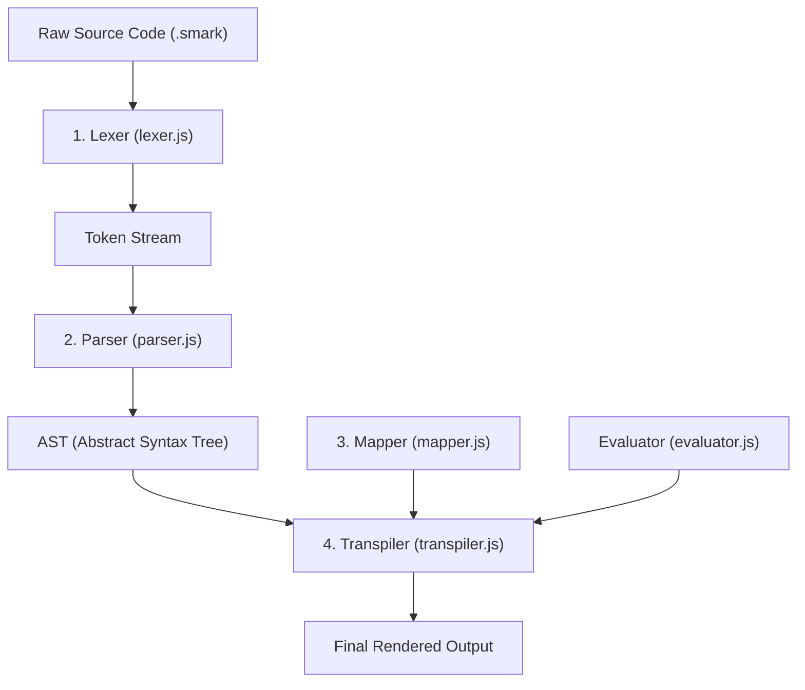

# SomMark Core Architecture

SomMark is a markup language that compiles into other formats — HTML, Markdown, MDX, XML, and more. You write content in `.smark` files, and SomMark translates them into whichever format you choose.

The key idea: SomMark does not output anything on its own. It reads your source, builds a data tree from it, and then uses a **Mapper** to decide what the output looks like. Swap the Mapper, and the same `.smark` source produces a completely different output format.

---

## How Compilation Works

SomMark processes your source in 4 steps:



### 1. Lexer
The **Lexer** reads your source one character at a time and breaks it into labeled pieces called **tokens**. For example, `[` becomes `OPEN_BRACKET`, `Button` becomes `IDENTIFIER`, and body text becomes `TEXT`.

### 2. Parser
The **Parser** takes the flat list of tokens and builds a tree from it — the **AST** (Abstract Syntax Tree). The tree captures which blocks are nested inside other blocks, what props each block has, and what text each block contains. The Parser also resolves prefix layers like `p{}` and `v{}` during this step.

### 3. Mapper
The **Mapper** is a set of rules: "when you see this block, output this string". For example, a rule might say `[h1]` → `<h1>`. Switching the Mapper changes the entire output format without touching your source files.

### 4. Transpiler
The **Transpiler** walks the AST one node at a time. For each node, it finds the matching rule in the Mapper, runs the render function, and adds the result to the output string.

---

## Scripts Inside Templates

SomMark lets you run JavaScript inside your templates using **logic blocks**. These scripts run at compile time, inside a **sandboxed VM** — completely separate from your main Node.js process.

* **Sandboxed**: Scripts cannot access your filesystem, environment variables, or Node.js APIs.
* **Scoped**: Variables inside one logic block do not leak into other blocks.

---

## Static Logic vs. Runtime Logic

SomMark has two types of logic blocks — one runs at compile time, the other runs later in the browser:

| | Static Logic | Runtime Logic |
| :--- | :--- | :--- |
| **Syntax** | `${ ... }$` | `runtime ${ ... }$` |
| **When it runs** | At compile time (when you call `transpile()`) | In the browser, after the page loads |
| **Where it runs** | Sandboxed QuickJS VM inside the compiler | The browser's JavaScript engine |
| **What the transpiler does** | Runs the code and embeds the result in the output | Wraps the code in a `<script>` tag and passes it through |

The `static` keyword is optional — `${ expr }$` and `static ${ expr }$` are identical.

### Static Logic Example

```mdx
Total price: ${ 100 * 1.2 }$
```

The compiler runs `100 * 1.2` and replaces the block with the result:

```html
Total price: 120
```

> You do not need a `return` statement. SomMark automatically uses the value of the last expression in the block.

### Runtime Logic Example

```js
runtime ${ 
  const total_price = 100 * 1.2;
  console.log(total_price);
}$
```

The compiler does not run this code. It passes it to the Mapper's `runtimeLogic()` function, which wraps it in a `<script>` tag:

```html
<script>
  const total_price = 100 * 1.2;
  console.log(total_price);
</script>
```

> A `runtime` block at the top level of your file (not inside any other block) becomes a plain global `<script>` tag.

---

## Full Example: One Block Through Every Step

Here is `[Button = disabled: true]Click Me[end:Button]` traced through each stage:

### 1. Source Input
```ini
[Button = disabled: true]Click Me[end:Button]
```

### 2. Lexer Output
Each piece of the source becomes a labeled token (ranges omitted for brevity):
```json
[
  { "type": "OPEN_BRACKET",  "value": "[" },
  { "type": "IDENTIFIER",    "value": "Button" },
  { "type": "WHITESPACE",    "value": " " },
  { "type": "EQUAL",         "value": "=" },
  { "type": "WHITESPACE",    "value": " " },
  { "type": "KEY",           "value": "disabled" },
  { "type": "COLON",         "value": ":" },
  { "type": "WHITESPACE",    "value": " " },
  { "type": "VALUE",         "value": "true" },
  { "type": "CLOSE_BRACKET", "value": "]" },
  { "type": "TEXT",          "value": "Click Me" },
  { "type": "OPEN_BRACKET",  "value": "[" },
  { "type": "END_KEYWORD",   "value": "end:Button" },
  { "type": "CLOSE_BRACKET", "value": "]" },
  { "type": "EOF",           "value": "" }
]
```

### 3. Parser Output
The flat token list becomes a nested node:
```json
[
  {
    "type": "Block",
    "id": "Button",
    "props": {
      "0": "true",
      "disabled": "true"
    },
    "body": [
      {
        "type": "Text",
        "text": "Click Me"
      }
    ]
  }
]
```

The `Button` block has one prop (`disabled: true`) and one child text node (`Click Me`). Every prop is stored twice: once by position (`"0"`) and once by name (`"disabled"`).

### 4. Mapper Rule (HTML)
```javascript
import SomMark from "sommark";

const myMapper = new SomMark.Mapper();

myMapper.register("Button", ({ props, content }) => {
    return SomMark.tag("button")
        .attributes({
            class: "btn btn-primary",
            disabled: props.disabled === "true"
        })
        .body(content);
});
```

### 5. Final Output
```html
<button class="btn btn-primary" disabled>Click Me</button>
```
