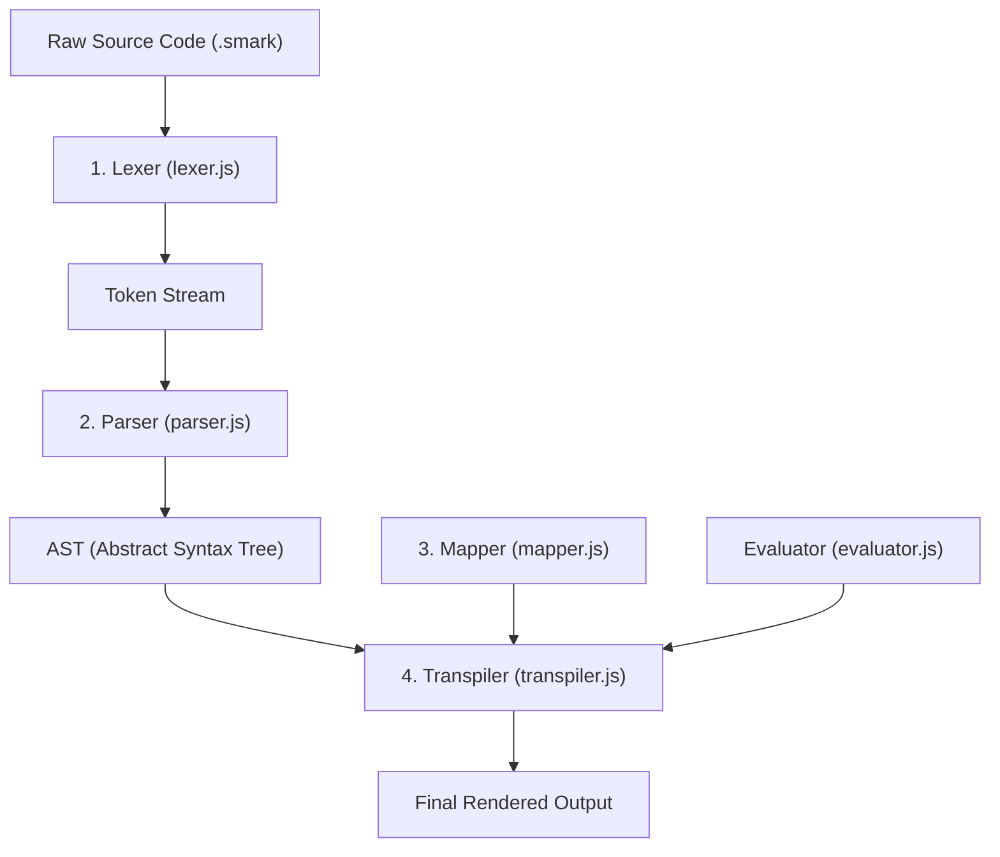

# SomMark Core Architecture

SomMark is a structured, extensible markup language. It is designed to act as a **universal source format** that compiles (transpiles) into other target languages, such as HTML, Markdown, MDX, or XML. 

Instead of rendering content directly, SomMark parses your text into a structured data tree. A separate translation layer, called the **Mapper**, decides exactly how that structured tree should be rendered into the target language.

---

## The 4-Stage Compilation Pipeline

The compilation lifecycle is split into four distinct, sequential stages:




### 1. Lexing
The **Lexer** scans your raw source code character by character. It identifies "structural markers" (like brackets and parentheses) and separates them from your body text. 
*   **Result**: A flat stream of **Tokens** (e.g., `OPEN_BRACKET`, `IDENTIFIER`, `TEXT`).

### 2. Parsing
The **Parser** takes the flat stream of tokens and organizes them into a hierarchical tree called an **AST** (Abstract Syntax Tree). 
*   **Responsibility**: It handles nesting (blocks inside blocks), resolves arguments, and recognizes prefix layers like `p{}`.
*   **Result**: A tree structure representing the logical layout of your document.

### 3. Mapping
The **Mapper** is the translation layer. It is a reference guide that defines how SomMark's identifiers (like `[card]`) should look in the target language. By switching the Mapper, you change the language SomMark transpiles into.

### 4. Transpilation
The **Transpiler** walks the AST and, for every node it finds, it consults the Mapper. It executes the renderer functions and stitches the results together into the final output.
*   **Result**: The final string in your target markup language.

---

## The Evaluator and Sandbox (`core/evaluator.js`)

SomMark lets you run JavaScript inside your templates using logic blocks. These scripts run securely inside a dedicated engine:
* **Safe Sandbox**: Scripts run inside a secure, lightweight virtual machine (QuickJS). This isolates the code to prevent it from accessing or harming your computer.
* **Blocked APIs**: Dangerous operations (like reading local files or making web requests) are blocked to keep your environment secure.
* **Isolated Scopes**: Script variables created inside loops or imported files are isolated to their specific areas. They are cleaned up immediately after running to prevent them from leaking.

---

## Static Logic vs. Runtime Logic

SomMark distinguishes between two types of logic blocks based on **when** and **where** they execute:

| Feature | Static Logic | Runtime Logic |
| :--- | :--- | :--- |
| **Syntax** | `static ${ ... }$` | `runtime ${ ... }$` |
| **Execution Time** | **Compile Time** (during transpilation) | **Client-side Runtime** (in the browser or app) |
| **Execution Context** | Sandboxed QuickJS VM inside the compiler | Target environment (Browser, etc.) |
| **Transpiler Action** | Executes the JS code, converts the result to a string, and embeds it in the output. | Passes the raw code string to the Mapper (`mapper.runtimeLogic()`) to generate runtime wrappers. |

### Code Examples

#### 1. Static Logic
In your Smark source file:
```mdx
Total price: static ${ 100 * 1.2 }$
```
**Note**: An explicit `return` statement is optional. SomMark automatically returns and embeds the value of the last evaluated expression statement in the block (matching standard JavaScript `eval` behavior).

* **Transpiler Action**: Executes `100 * 1.2` during compilation using QuickJS.
* **Compiled HTML Output**:
```html
Total price: 120
```

#### 2. Runtime Logic
In your Smark source file: (global scope):
```js
runtime ${ 
  const total_price = 100 * 1.2;
  console.log(total_price);
}$
```
**Note**: If you use runtime logic in top-level (not inside blocks), it will be considered global scope so just a script tag is wrapped with the code.

* **Transpiler Action**: Leaves the logic string `count` untouched. Passes it to the active Mapper's `runtimeLogic()` renderer function.
* **Compiled HTML Output** (using a standard HTML web framework mapper):
```html
<script>
  const total_price = 100 * 1.2;
  console.log(total_price);
</script>
```

---

## Code Example: The Entire Lifecycle

Here is a concrete example tracing a custom tag `[Button]` through the entire pipeline:

### 1. Raw SomMark Input
```ini
[Button = disabled: true]Click Me[end]
```

### 2. Lexer Tokens Output
```json
[
  {
    "type": "OPEN_BRACKET",
    "value": "[",
    "source": "anonymous",
    "range": {
      "start": {
        "line": 0,
        "character": 0
      },
      "end": {
        "line": 0,
        "character": 1
      }
    }
  },
  {
    "type": "IDENTIFIER",
    "value": "Button",
    "source": "anonymous",
    "range": {
      "start": {
        "line": 0,
        "character": 1
      },
      "end": {
        "line": 0,
        "character": 7
      }
    }
  },
  {
    "type": "WHITESPACE",
    "value": " ",
    "source": "anonymous",
    "range": {
      "start": {
        "line": 0,
        "character": 7
      },
      "end": {
        "line": 0,
        "character": 8
      }
    }
  },
  {
    "type": "EQUAL",
    "value": "=",
    "source": "anonymous",
    "range": {
      "start": {
        "line": 0,
        "character": 8
      },
      "end": {
        "line": 0,
        "character": 9
      }
    }
  },
  {
    "type": "WHITESPACE",
    "value": " ",
    "source": "anonymous",
    "range": {
      "start": {
        "line": 0,
        "character": 9
      },
      "end": {
        "line": 0,
        "character": 10
      }
    }
  },
  {
    "type": "KEY",
    "value": "disabled",
    "source": "anonymous",
    "range": {
      "start": {
        "line": 0,
        "character": 10
      },
      "end": {
        "line": 0,
        "character": 18
      }
    }
  },
  {
    "type": "COLON",
    "value": ":",
    "source": "anonymous",
    "range": {
      "start": {
        "line": 0,
        "character": 18
      },
      "end": {
        "line": 0,
        "character": 19
      }
    }
  },
  {
    "type": "WHITESPACE",
    "value": " ",
    "source": "anonymous",
    "range": {
      "start": {
        "line": 0,
        "character": 19
      },
      "end": {
        "line": 0,
        "character": 20
      }
    }
  },
  {
    "type": "VALUE",
    "value": "true",
    "source": "anonymous",
    "range": {
      "start": {
        "line": 0,
        "character": 20
      },
      "end": {
        "line": 0,
        "character": 24
      }
    }
  },
  {
    "type": "CLOSE_BRACKET",
    "value": "]",
    "source": "anonymous",
    "range": {
      "start": {
        "line": 0,
        "character": 24
      },
      "end": {
        "line": 0,
        "character": 25
      }
    }
  },
  {
    "type": "TEXT",
    "value": "Click Me",
    "source": "anonymous",
    "range": {
      "start": {
        "line": 0,
        "character": 25
      },
      "end": {
        "line": 0,
        "character": 33
      }
    }
  },
  {
    "type": "OPEN_BRACKET",
    "value": "[",
    "source": "anonymous",
    "range": {
      "start": {
        "line": 0,
        "character": 33
      },
      "end": {
        "line": 0,
        "character": 34
      }
    }
  },
  {
    "type": "END_KEYWORD",
    "value": "end",
    "source": "anonymous",
    "range": {
      "start": {
        "line": 0,
        "character": 34
      },
      "end": {
        "line": 0,
        "character": 37
      }
    }
  },
  {
    "type": "CLOSE_BRACKET",
    "value": "]",
    "source": "anonymous",
    "range": {
      "start": {
        "line": 0,
        "character": 37
      },
      "end": {
        "line": 0,
        "character": 38
      }
    }
  },
  {
    "type": "EOF",
    "value": "",
    "source": "anonymous",
    "range": {
      "start": {
        "line": 0,
        "character": 38
      },
      "end": {
        "line": 0,
        "character": 38
      }
    }
  }
]
```

### 3. Parser AST Node Representation
```json
[
  {
    "type": "Block",
    "structure": "Block",
    "id": "Button",
    "args": {
      "0": "true",
      "disabled": "true"
    },
    "body": [
      {
        "type": "Text",
        "structure": "Text",
        "text": "Click Me",
        "depth": 2,
        "range": {
          "start": {
            "line": 0,
            "character": 25
          },
          "end": {
            "line": 0,
            "character": 33
          }
        }
      }
    ],
    "depth": 1,
    "range": {
      "start": {
        "line": 0,
        "character": 0
      },
      "end": {
        "line": 0,
        "character": 38
      }
    }
  }
]
```

### 4. Mapper Definition (HTML)
```javascript
import SomMark from "sommark";

const myMapper = new SomMark.Mapper();

myMapper.register("Button", ({ args, content }) => {
    return SomMark.tag("button")
        .attributes({
            class: "btn btn-primary",
            disabled: args.disabled === "true"
        })
        .body(content);
});
```

### 5. Final Transpiled Output
```html
<button class="btn btn-primary" disabled>Click Me</button>
```
