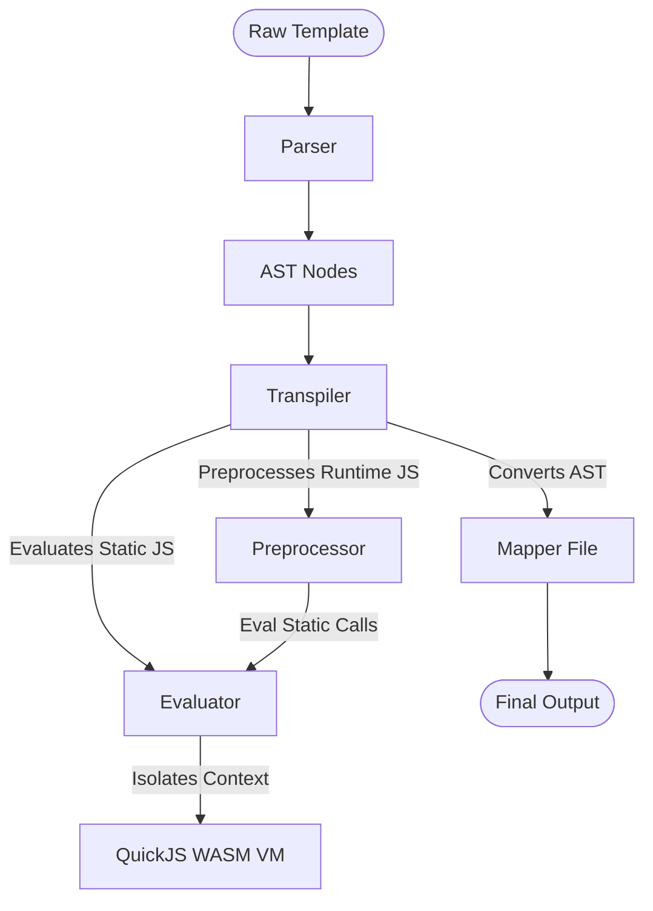

# SomMark Core Execution Platform (Evaluator, Preprocessor & Transpiler)

This document provides a highly condensed, example-driven reference for the core templating, sandboxing, and compilation components of the SomMark engine.

---

## 1. Core Workflow Overview



---

## 2. The Evaluator (`evaluator.js`)

`Evaluator` runs all sandboxed compilation-time JS using QuickJS WebAssembly.

### Scope Stack & Variable Lifecycle
Manages isolated execution contexts and automatically synchronizes variables back and forth.
* **AST Auto-Export**: Uses Acorn to scan evaluated JS. Any top-level variable/function declaration (`let`, `const`, `var`, `function`, `import`) is automatically exported to the active compiler scope.
* **Scope Synchronization**: Synchronizes QuickJS VM variable values back to the active Node.js execution scopes at the end of each evaluation.

---

### The Sandbox `SomMark` Standard Library
Every QuickJS sandboxed VM exposes a frozen global `SomMark` namespace providing APIs:

| API Member | Description | Example |
| :--- | :--- | :--- |
| `SomMark.version` | Read-only version string. | `SomMark.version` (e.g. `"4.1.0"`) |
| `SomMark.settings` | Frozen compilation settings. | `SomMark.settings.format` |
| `SomMark.register(id, render, options)` | Registers dynamic VM tags. | `SomMark.register("card", ({ args }) => ...)` |
| `SomMark.get(id)` | Retrieves host/local tag definitions. | `SomMark.get("link")` |
| `SomMark.removeOutput(id)` | Unregisters tag from VM scope. | `SomMark.removeOutput("card")` |
| `SomMark.includesId(ids)` | Checks if tags are registered. | `SomMark.includesId(["div", "card"])` |
| `SomMark.tag(tagName)` | Programmatic tag/attribute builder. | `SomMark.tag("div").attributes(a).body(c)` |
| `SomMark.fetch(url, init)` | Security-guarded HTTP request. | `await SomMark.fetch("https://api.site.com")` |
| `SomMark.compile(src, options)` | Recursively compiles nested Smark. | `await SomMark.compile("[div]Text[end]")` |
| `SomMark.raw(html)` | Passes raw HTML without escaping. | `SomMark.raw("<strong>Unescaped</strong>")` |

#### Concrete Sandbox Execution Example
An active sandboxed VM evaluating a dynamic component mapping using the standard library APIs:
```javascript
// This script runs securely inside the QuickJS sandbox
SomMark.register("user-profile", ({ args, content }) => {
    // SomMark.tag returns a TagBuilder instance. 
    // .attributes() returns 'this' for chaining.
    // .body() or .selfClose() compiles/renders the final string.
    return SomMark.tag("div")
        .attributes({
            class: "profile-card",
            "data-status": args.status || "active",
            style: args.style
        })
        .body(
            SomMark.tag("h3").body(args.name) +
            SomMark.tag("div").attributes({ class: "bio" }).body(content)
        );
});
```

---

### Security Architecture

The Evaluator enforces strict SSRF, file access, and execution time boundaries:

#### 1. SSRF Guard (Fetch Protection)
* **HTTPS Enforcement**: Blocks all `http:` requests by default (`allowHttp: false`).
* **Private Network Restrictions**: Requests to local or loopback domains are explicitly blocked:
  * Local/Loopbacks: `localhost`, `127.0.0.1`, `0.0.0.0`, `[::1]`, `::`
  * Private/Intranet Subnets (RFC 1918): `10.*.*.*`, `192.168.*.*`, `172.16.*.*` to `172.31.*.*`
  * Link-Local: `169.254.*.*`
* **Whitelists**: Enforces `allowedOrigins` (e.g. `["https://api.github.com"]`) and `allowedExtensions` (e.g. `[".json"]`) when provided.

#### 2. Infinite Loop Interrupt Safety
An active background timer interrupt terminates VM context execution immediately if evaluation runs longer than the designated deadline:
```javascript
// QuickJS Interruption Handler Configuration
this.runtime.vm.context.runtime.setInterruptHandler(() => {
    return this.deadline > 0 && Date.now() > this.deadline; // default 5000ms timeout limit
});
```

---

## 3. The Runtime Preprocessor (`preprocessor.js`)

Optimizes scripts inside `runtime ${...}$` blocks at compile-time by parsing their AST with **Acorn** to locate, execute, and inline `static` and `import` calls.

```javascript
// Preprocessing workflow example
import { preprocessRuntimeLogic } from "./core/helpers/preprocessor.js";

// Input runtime block code containing compile-time placeholders
const code = `
    const userRole = SomMark.static("getUserDefaultRole()");
    const dictionary = SomMark.import("./locales/en.json");
    console.log(userRole, dictionary.welcome);
`;

const preprocessed = await preprocessRuntimeLogic(code, "/app/template.smark");
// Output:
// /* global SomMark */
// if (typeof globalThis.SomMark === 'undefined') { ... }
// const userRole = "guest";
// const dictionary = {"welcome":"Welcome to our application!"};
// console.log(userRole, dictionary.welcome);
```

---

## 4. The Transpiler (`transpiler.js`)

Converts AST nodes into final text representations (HTML, Markdown, MDX, etc.) using mapping rules.

### AST-based `[for-each]` Loops
Iterates through arrays, isolating VM scopes transparently for each iteration.

---

## 5. End-to-End Examples

### Complete Template: Fetching Static API Data
Performs compile-time data loading and formats structured output.

```js
static ${
    // 1. Fetch remote JSON securely inside sandbox
    const res = await SomMark.fetch("https://api.github.com/repos/Adam-Elmi/SomMark");
    const repo = await res.json();

    // 2. Register dynamic VM-scoped renderer component
    SomMark.register("repo-badge", ({ args }) => {
        return SomMark.tag("span")
            .attributes({ 
                class: "badge", 
                style: `background: ${args.color || "#0366d6"}` 
            })
            .body("⭐ " + args.stars);
    });

    // 3. Store resolved data in VM global scope for Smark access
    globalThis.repoStats = {
        name: repo.name,
        stars: repo.stargazers_count
    };
}$

[div = class: "card"]
  [h3]static ${repoStats.name}$[end]
  [repo-badge = stars: static ${repoStats.stars}$, color: "#ff5500"][end]
[end]
```

### Complete Template: Local Module Import
Compiles nested modular Smark fragments inside runtime blocks.

> [!WARNING]
> This example assumes that the `components/Item.smark` file is located in the same directory as the template being compiled.

```ini
static ${
    // The sandbox module loader loads local templates and exposes them as render functions
    const { default: ItemLayout } = await import("./components/Item.smark");

    SomMark.register("product-list", async ({ args }) => {
        let listHtml = "";
        const products = args.items || [];
        
        for (const prod of products) {
            // Render the external sub-template passing parameters
            listHtml += await ItemLayout({
                title: prod.name,
                price: prod.price
            });
        }
        
        return SomMark.tag("div").attributes({ class: "products" }).body(listHtml);
    });
}$

[product-list = items: js{[ { name: "Pen", price: 1.50 }, { name: "Notebook", price: 4.99 } ]}][end]
```
